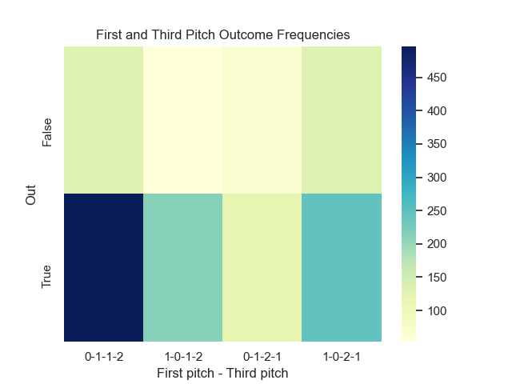

# Pitching Counts Outcomes

"'The difference between 1-2 and 2-1 in terms of expected outcomes is enormous, says Paul'" - *Moneyball*, Michael Lewis.

Welcome! This readme doc will show how to use my pitch count data generator and plotter. Required packages include Pybaseball version 2.2.1, pandas, numpy, seaborn, matplotlib, and argparse. 

## Third Pitch Generator

This python file will output a csv file containing the outcome, date, third pitch count, first pitch count, and at-bat number for every at-bat this pitcher faced. The user must specify the pitchers last name, first name, start date, and end date. The date range need not be their entire career. For example,

```{Python}
python third_pitch_generator.py -l buehler -f walker -s 2017-04-08 -e 2022-05-28
```

In short, `third_pitch_generator.py` is calling PyBaseball's statcast_pitcher and
playerid_lookup functionality to retrieve a standard statcast dataset of the pitcher. The file then filters and reshapes the statcast data such that it displays the first pitch count (1-0 or 0-1) and third pitch count (1-2 or 2-1) for every unique at-bat within the specified date range.

## Plotting

Next, `plotter.py` will take the csv generated from `third_pitch_generator.py` and create a heatmap of first and third pitches and their frequencies per at-bat outcome. Note that outcome False means the at-bat resulted in an out. Outcome True means the at-bat resulted in a hit, BB, HBP, or intentional BB. `plotter.py` requires a data file and player name (i.e. file name). The python file does a little data augmentation to accommodate Seaborn's heatmap format.

Example:

```{Python}
python plotter.py --data counts_buehler.csv --name buehler
```

Output: 


